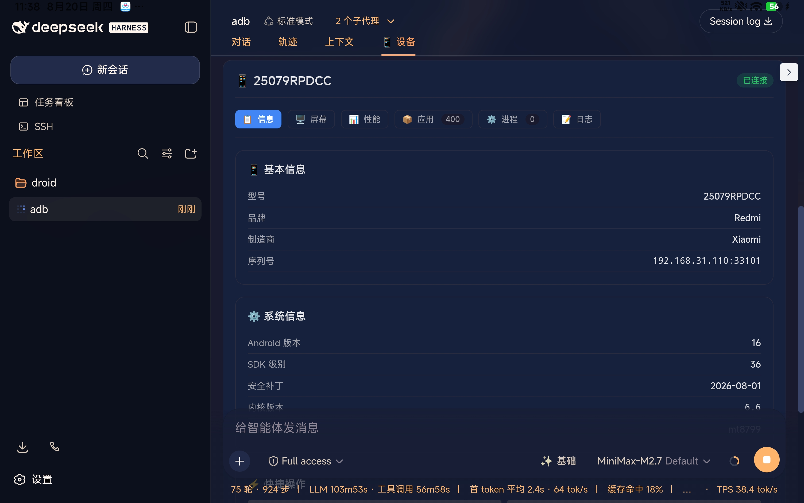
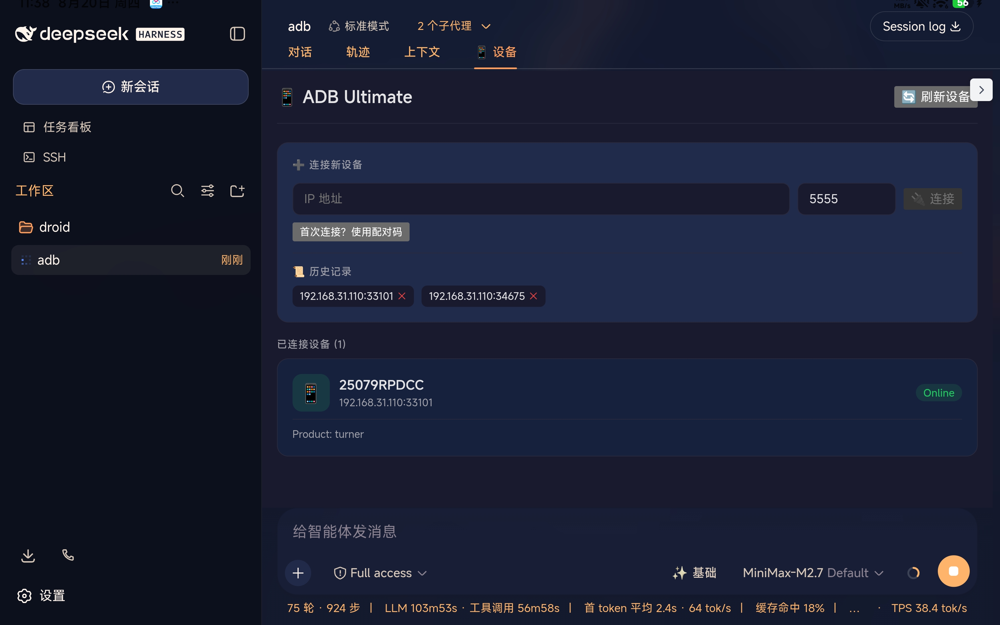
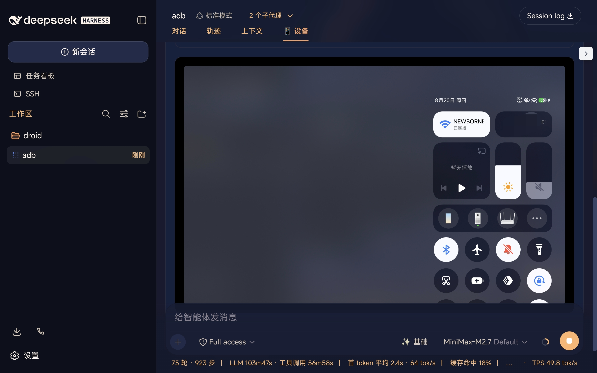

# dsh-adb-ultimate

[English](README.md) | [中文](README.zh.md)

[](https://www.npmjs.com/package/dsh-adb-ultimate)
[](https://github.com/newborne/dsh-adb-ultimate)

Full-featured ADB device management plugin for [DeepSeek Harness (DSH)](https://github.com/deepseek-ai/deepseek-harness).



## Features

### 📱 Device Panel

Embeds a complete device management panel in the DSH session with 5 tabs:

| Tab | Features |
|-----|----------|
| 🖥️ **Screen** | Real-time device screen monitoring with play/pause (1s interval) |
| 📊 **Performance** | Real-time memory, CPU, battery status (auto-refresh) |
| 📋 **Info** | Device model, Android version, serial number, etc. |
| 📦 **Apps** | Browse, search, view app details (version, permissions) |
| 📝 **Logs** | Real-time logcat output with V/D/I/W/E level filtering |

### 🔌 Device Connection

- **WiFi Connect** - Connect to Android device via IP address
- **WiFi Pair** - Support pairing verification for first-time connections
- **Connection History** - Auto-save history for quick reconnect
- **Multi-device** - Manage multiple devices simultaneously

### 🎮 Device Control

- **Screen** - Screenshot, screen on/off, real-time monitoring
- **Input** - Tap, swipe, text input, key events
- **Apps** - Install, uninstall, launch, force stop
- **File** - Push/pull files

### 📊 Performance Monitoring

- **Memory** - Real-time RAM usage
- **Battery** - Level, temperature, health status
- **CPU** - Cores, processor model

### 🔧 System Debug

- **Logcat** - Real-time log output with level filtering
- **Dumpsys** - Query system service info
- **Getprop** - Read system properties
- **Shell** - Execute shell commands directly

## Install

> 💡 Copy any install command below and give it to Agent for automatic installation

### Way 1: GitHub Install

```bash
dsh plugin --profile web add github:newborne/dsh-adb-ultimate
```

### Way 2: Local Install

```bash
# Clone the repo
git clone https://github.com/newborne/dsh-adb-ultimate.git

# Install to DSH
dsh plugin --profile web add /path/to/dsh-adb-ultimate
```

### Way 3: Natural Language Install

Just tell Agent:
> "Help me install this plugin: https://github.com/newborne/dsh-adb-ultimate"

## Interface Preview

### 1. Tablet Configuration

Enable WiFi ADB debugging on your tablet:


### 2. Plugin Overview

DSH Web UI embeds a complete device management panel:


### 3. Device Connection

Connect new devices, view history, manage connected devices:



### 4. Real-time Screen Monitoring

Real-time device screen with 1-second auto-refresh:



## License

MIT
