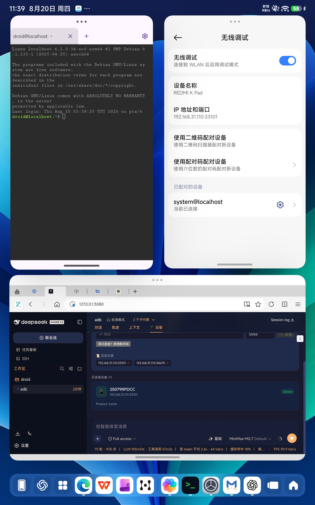

# dsh-adb-ultimate

[English](README.md) | [中文](README.zh.md)

[](https://www.npmjs.com/package/dsh-adb-ultimate)
[](https://github.com/newborne/dsh-adb-ultimate)
[](https://opensource.org/licenses/MIT)

全功能 ADB 设备管理插件，专为 [DeepSeek Harness (DSH)](https://github.com/deepseek-ai/deepseek-harness) 设计。


## 🚀 项目动机

我在平板的安卓系统里内置了一个叫 **DROID** 的 Linux 环境，并在其中部署了 **DSH 服务**。

> 作为一个热爱折腾的极客，我希望能够**用 AI 来操控自己的设备**，实现「自我控制」—— 让 AI 能够：
> - 看到设备的实时屏幕
> - 执行任意的系统操作
> - 自动化管理设备上的应用和文件
> - 监控系统性能和状态
> - ……

带着这样的想法，**dsh-adb-ultimate** 插件诞生了。它让 DSH 能够通过 ADB 协议全面控制 Android 设备，真正实现「AI 做你的手机管家」。

## ✨ 功能介绍

### 📱 设备面板

在 DSH 会话中嵌入完整的设备管理面板，包含 5 个标签页：

| 标签 | 功能 |
|------|------|
| 🖥️ **屏幕** | 实时监控设备屏幕，支持播放/暂停（1秒间隔） |
| 📊 **性能** | 实时显示内存、CPU、电池状态（自动刷新） |
| 📋 **信息** | 设备型号、Android 版本、序列号等 |
| 📦 **应用** | 浏览、搜索、查看应用详情（版本号、权限等） |
| 📝 **日志** | 实时 logcat 输出，支持 V/D/I/W/E 级别过滤 |

### 🔌 设备连接

- **无线连接** - 通过 IP 地址连接 Android 设备
- **WiFi 配对** - 支持首次连接时的配对验证
- **连接历史** - 自动保存连接历史，快速重连
- **多设备管理** - 同时管理多台设备

### 🎮 设备控制

- **屏幕** - 截图、屏幕开关、实时监控
- **输入** - 点击、滑动、文本输入、按键事件
- **应用** - 安装、卸载、启动、强制停止
- **文件** - 推送、拉取文件

### 📊 性能监控

- **内存** - 实时 RAM 使用率
- **电池** - 电量百分比，温度、健康状态
- **CPU** - 核心数、处理器型号

### 🔧 系统调试

- **Logcat** - 实时日志输出，按级别过滤
- **Dumpsys** - 查询系统服务信息
- **Getprop** - 读取系统属性
- **Shell** - 直接执行 Shell 命令

## 🔧 安装

> 💡 将以下任意安装命令复制给 Agent 即可自动安装

### 方式一：GitHub 安装

```bash
dsh plugin --profile web add github:newborne/dsh-adb-ultimate
```

### 方式二：本地安装

```bash
# 克隆仓库
git clone https://github.com/newborne/dsh-adb-ultimate.git

# 安装到 DSH
dsh plugin --profile web add /path/to/dsh-adb-ultimate
```

### 方式三：自然语言安装

直接对 Agent 说：
> "帮我安装这个插件：https://github.com/newborne/dsh-adb-ultimate"

## 📸 界面预览

### 1. 平板端配置

在平板上开启 WiFi ADB 调试，并可通过 DROID Linux 环境进行管理：



### 2. 插件功能总览

DSH Web UI 中嵌入完整的设备管理面板，包含：屏幕监控、性能、应用详情标签页：


### 3. 设备连接管理

支持连接新设备、查看历史记录、管理已连接设备：


### 4. 实时屏幕监控

开启后可以实时查看设备屏幕，1 秒间隔自动刷新：


## 📄 License

MIT
